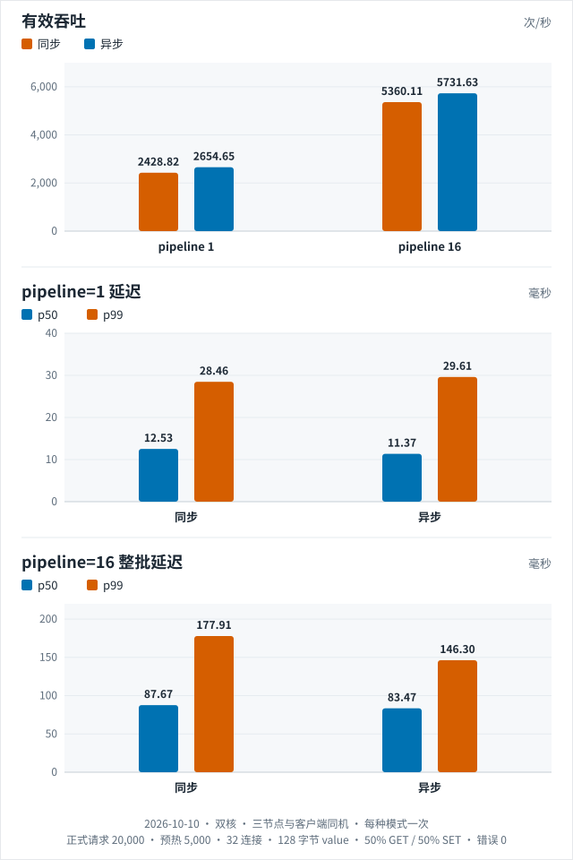

[English](README.md) | 简体中文

# Raft-KV

[](https://github.com/Die4U23/Raft-KV/actions/workflows/portable.yml)
[](https://github.com/Die4U23/Raft-KV/actions/workflows/linux-cluster.yml)

一个用 C++17 实现的三节点 Raft KV 存储学习项目，把 Muduo 网络接入、Raft 共识、RocksDB 持久化、有界并发与真实故障验证放进同一条请求链路。

项目实践长文：[从三节点存储到故障验证与性能优化](docs/raft-kv-project-practice.md)。

## 核心能力

- **Raft 写路径**：Leader 选举、日志复制、多数派提交、顺序状态机应用。
- **ReadIndex 线性一致读**：通过心跳多数派确认读屏障，等待本地应用位置追上后读取，无需日志复制即可保证线性一致性。
- **持久化语义**：Raft 日志和硬状态同步落盘；KV 与 `lastApplied` 在同一 RocksDB WriteBatch 中提交。
- **有界服务**：限制连接数、输入/输出缓冲、写队列、提案数及字节数，过载时拒绝而不是无限积压。
- **批量与异步应用**：单个 EventLoop 轮次内组批，已提交 KV 批次交给串行工作线程，完成回调回到所有者线程。
- **RESP 协议接入**：处理 TCP 分片/粘包、连续命令、二进制 value 和恶意长度输入。
- **可追溯验证**：分区、Leader 崩溃/重启、过载和对照实验都保留报告、节点日志、源码/二进制指纹及独立核验脚本。

## 架构

```text
客户端（RESP）
      │
      ▼
Muduo Client Server ── GET ──► KVStateMachine ──► RocksDB
      │                         ▲
      └─ SET / DEL ─► RaftNode ───────┘
                         │
              ┌──────────┴──────────┐
              ▼                     ▼
        RaftLog / RocksDB      PeerManager / Muduo
                                    │
                              其他 Raft 节点
```

写请求在 Leader 上入日志，通过 PeerManager 复制到多数节点，推进 `commit_index`，再按序应用到 KV 状态机。详细时序、线程归属与回调生命周期见[并发处理说明](docs/concurrency.md)。

## 已验证结果

下表是 2026-09-08 至 09-13 的归档，当时可移植 CTest 是 5 或 7 个目标。当前套件和 ReadIndex / Pre-Vote 的范围见 [项目状态](docs/review-status.md)。这些归档没有在后来的二进制上重跑。

| 场景 | 结果 | 证据 |
| --- | --- | --- |
| Ubuntu 26.04 三进程冒烟 | 构建、CTest 5/5、冒烟 10/10 | [全量构建记录](docs/benchmarks/linux-fresh-validation.md) |
| 短时 TCP 分区 | 隔离旧 Leader、多数派继续写入、恢复后副本收敛 | [分区验证](docs/benchmarks/partition-validation.md) |
| 持续写入中崩溃/重启 | 1,704 个已确认键在两次恢复后的三副本上保留 | [恢复验证](docs/benchmarks/write-restart-validation.md) |
| 过载与 60 秒观察 | 连接准入、`BUSY`、恢复清零和资源阈值均通过 | [过载验证](docs/benchmarks/overload-validation.md) |

2026-10-10 在这台双核机器上跑了一次对照：三个节点和客户端同机，32 连接，128 字节 value，50% GET / 50% SET，预热 5,000 次，再正式测量 20,000 次。`group_commit_ms=1`，`snapshot_threshold=1024`。每种模式各一次。四个单元错误都是 0。测量窗口里整机空闲大约 1% 到 2%。

`pipeline=1` 的延迟是单次请求往返：

| 模式 | 有效吞吐 | p50 | p99 |
| --- | ---: | ---: | ---: |
| 同步应用 | 2,428.82 ops/s | 12.53 ms | 28.46 ms |
| 串行异步应用 | 2,654.65 ops/s | 11.37 ms | 29.61 ms |

`pipeline=16` 的延迟是 16 条命令的整批延迟：

| 模式 | 有效吞吐 | 整批 p50 | 整批 p99 |
| --- | ---: | ---: | ---: |
| 同步应用 | 5,360.11 ops/s | 87.67 ms | 177.91 ms |
| 串行异步应用 | 5,731.63 ops/s | 83.47 ms | 146.30 ms |

[](docs/benchmarks/async-apply-compare-2026-10-10.json)

这些是这台机器、这份负载上的一次测量。每种模式只跑了一次，这次的差距不是稳定差异。`pipeline=16` 的异步单元里，观察到的最大 `apply_lag` 是 32；其余三个单元是 0。更早的四轮归档仍在[性能基线](docs/benchmarks/ubuntu-2cpu-abba.md)。这次的报告是 [async-apply-compare-2026-10-10.json](docs/benchmarks/async-apply-compare-2026-10-10.json)。

## 快速开始

### 1. 构建

Ubuntu 上推荐使用会记录源码、依赖与二进制身份的自动流程：

```bash
python3 scripts/build_linux.py --jobs 2 --smoke
```

成功后服务位于 `build-linux-repro/server/raft_kv_server`。系统依赖、Muduo 准备方式和报告结构见 [Ubuntu 构建说明](docs/linux-build.md)。

只运行不依赖 Muduo/RocksDB 实库的可移植回归：

```bash
cmake -S . -B build-portable -G Ninja \
  -DRAFTKV_BUILD_SERVER=OFF -DCMAKE_BUILD_TYPE=Debug
cmake --build build-portable --parallel 2
ctest --test-dir build-portable --output-on-failure
python3 -m unittest discover -s tests -p '*_tests.py'
```

### 2. 一条命令演示

用已经编好的 Linux 服务起三个进程：选出 Leader，写入并在三个节点读到，Follower 上的 `SET` 返回 `MOVED`，杀掉 Leader 后新 Leader 仍能读到旧数据并继续写，旧进程用原来的目录重启后三个节点一致。这是同一台机器上的三个进程。

```bash
python3 scripts/demo.py \
  --binary build-linux-repro/server/raft_kv_server
```

加上 `--hold` 时，演示结束后进程先留着，可以用 `redis-cli -p <客户端端口>` 再试，按回车才退出。

### 3. 手动启动三节点

为每个节点使用配对且独立的 KV / Raft 目录：

```bash
$BIN --node_id=0 --client_port=8080 --raft_port=9080 \
  --db_path=/tmp/kv_db_0 --raft_log_path=/tmp/raft_log_0 \
  --linearizable_reads=true
$BIN --node_id=1 --client_port=8081 --raft_port=9081 \
  --db_path=/tmp/kv_db_1 --raft_log_path=/tmp/raft_log_1 \
  --linearizable_reads=true
$BIN --node_id=2 --client_port=8082 --raft_port=9082 \
  --db_path=/tmp/kv_db_2 --raft_log_path=/tmp/raft_log_2 \
  --linearizable_reads=true
```

三条命令需在三个终端分别运行。启动后用 `redis-cli -p 8080 INFO` 查看角色和 Leader。

同一台机器上也可以用运行镜像起三个容器。每个容器有自己的数据卷，KV 和 Raft 日志都在该卷的 `/data` 下。`GET /health` 只说明这个进程还在服务，不说明它是 Leader，也不说明多数派还在。

```bash
docker compose -f docker/compose.yaml up --build
curl -fsS localhost:9090/health
```

**可选配置**：
- `--linearizable_reads=true`：启用 ReadIndex 线性一致读（默认 false）
- `--lease_reads=true`：在线性一致读下，Leader 租约有效时本地确认 GET（默认 false）
- `--leader_only_reads=true`：仅在 Leader 节点响应读请求（默认 false）
- `--metrics_port=9090`：在该端口提供 `GET /metrics`（Prometheus 文本）和 `GET /health`。默认 0，不监听。不能与 `client_port` 或 `raft_port` 相同

### 4. 读写

```bash
redis-cli -p 8080 SET user:1 alice
redis-cli -p 8080 GET user:1
redis-cli -p 8080 DEL user:1
```

向 Follower 写入会返回项目自定义的 `-ERR MOVED <leader_id>`；它不是 Redis Cluster 的完整重定向协议。

## 客户端命令

| 命令 | 语义 |
| --- | --- |
| `PING` | 返回 `PONG` |
| `SET key value` | 通过 Raft 提交和状态机应用后返回 `OK` |
| `GET key` | 默认读当前节点本地状态机；`--linearizable_reads=true` 时 Leader 走 ReadIndex，再加 `--lease_reads=true` 时租约有效则本地确认。Follower 返回 `MOVED` |
| `DEL key` | 通过 Raft 删除，返回 `0` 或 `1` |
| `SELECT namespace` | 为当前 TCP 连接选择逻辑命名空间 |
| `INFO` | 查看角色、任期、Leader、提交/应用位置和过载指标。`--metrics_port` 非 0 时，同一组数字也可从 `GET /metrics` 抓取 |

`SELECT` 只在当前连接上生效，分别执行的 `redis-cli` 进程不会共享命名空间状态。

## 验证层级

- **可移植 C++ 回归**：协议、Raft 边界、存储批量、异步执行器、组批和重连策略。
- **Python 辅助测试**：构建流程、客户端模式、性能对照与故障编排的可测部分。
- **Linux 真实服务**：Muduo TCP、Protobuf、RocksDB、三进程冒烟与故障注入。
- **证据核验**：`docs/benchmarks/verify_*.py` 对归档、哈希、报告与节点日志做交叉检查。

完整命令和每层能够/不能证明的内容见 [tests/README.md](tests/README.md)。

## 当前边界

- 集群是固定成员的单 Raft 组，没有动态成员变更和多分片。
- 快照截掉已应用前缀（`--snapshot_threshold`，默认 1024，0 表示关闭）。已应用但还留在日志里的条数小于这个阈值；阈值之后新写入的条目会再积累，到下一次阈值再截。重启用尾记录确定终点，并读出这段后缀；中间条目损坏会在打开时失败。
- 普通 `SET` / `DEL` 不去重。`IDEMP <client-id> <request-id> SET|DEL ...` 只保留该客户端最近一次请求：相同 id 返回第一次的回复，更小的 id 返回 stale。
- 已受理但 1000 ms 内还没提交的写，客户端收到 `-ERR proposal timeout; outcome unknown`。这条日志仍留在 Raft 里，稍后仍可能提交。
- 已有验证不覆盖整机掉电、存储介质损坏、长时间压测或完整 Raft 正确性证明。

详细实现范围与验证边界见 [项目状态](docs/review-status.md)。

## 项目导航

```text
src/server/        RESP 接入、会话、组批与过载保护
src/raft/          RaftNode、PeerManager、KV 状态机与串行应用器
src/raftcore/      Raft 日志及硬状态持久化
src/storage/       RocksDB 封装和存储错误边界
src/common/        RESP、组批、指标和重连策略
src/namespace/     按连接管理的逻辑命名空间
proto/             Raft RPC 消息
tests/             可移植回归、真实集群故障测试与压测工具
docs/benchmarks/   原始证据、核验脚本和结果边界
scripts/           Linux 构建与固定 Muduo 准备流程
```

进一步阅读：[测试说明](tests/README.md) · [构建说明](docs/linux-build.md) · [压测方法](docs/benchmark.md) · [读一致性保证](docs/read-consistency.md) · [更新日志](CHANGELOG.md)

## 路线图

1. ✅ ~~ReadIndex 线性一致读~~：多数派确认读屏障，等待本地应用位置追上后再读取。默认关闭。选举截止时间和探针租约用同一把 `steady_clock`。隔离旧 Leader 在 CheckQuorum 到期后卸任，线性一致 GET 失败而不是返回过期值。
2. ✅ ~~Pre-Vote~~：选举超时先进入 pre-candidate，不抬任期、不记 `votedFor`。只有多数派预投票才开始真正的选举。竞选失败后回到预投票，而不是再次抬任期。
3. ✅ ~~快照与日志回收~~：已应用前缀换成 KV 快照，落后副本用分块 `InstallSnapshot` 追上。日志更长且任期冲突的副本会把 `nextIndex` 一次跳到冲突任期的起点，落在快照里就安装快照。已应用但还留在日志里的条数小于 `--snapshot_threshold`。
4. `IDEMP` 为带客户端和请求号的写提供去重。普通 `SET` / `DEL` 的重试仍可能执行两次。每个 client id 只保留最近一次，记录随快照保留，不会过期。

## 依赖与来源

主要依赖为 Muduo、RocksDB、Protobuf、gflags、glog 与 Boost。

项目的实现与设计参考了以下论文、资料和开源项目：

| 参考项目 | 地址 | 用途 |
|---|---|---|
| **Raft 论文** | https://raft.github.io/raft.pdf | Raft 算法权威文档 |
| **Raft 可视化** | https://raft.github.io/ | 帮助理解选举与日志复制 |
| **muduo** | https://github.com/chenshuo/muduo | 网络层 |
| **RocksDB** | https://github.com/facebook/rocksdb | 存储引擎 |
| **etcd** | https://github.com/etcd-io/etcd | 成熟 Raft 应用，思路参考 |
| **TiKV** | https://github.com/tikv/tikv | Raft + RocksDB 工业实践 |

感谢这些开源项目及其维护者提供的学习资源。可追溯的后续改造范围在[项目实践长文](docs/raft-kv-project-practice.md#项目来源许可证与改造范围)中单独列出。

## 许可证

本项目采用 [MIT License](LICENSE) 开源许可证。
