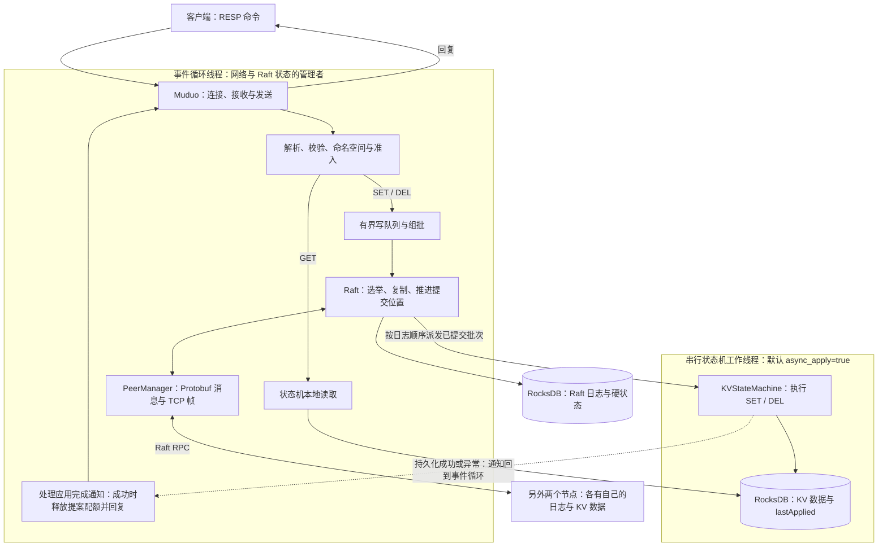
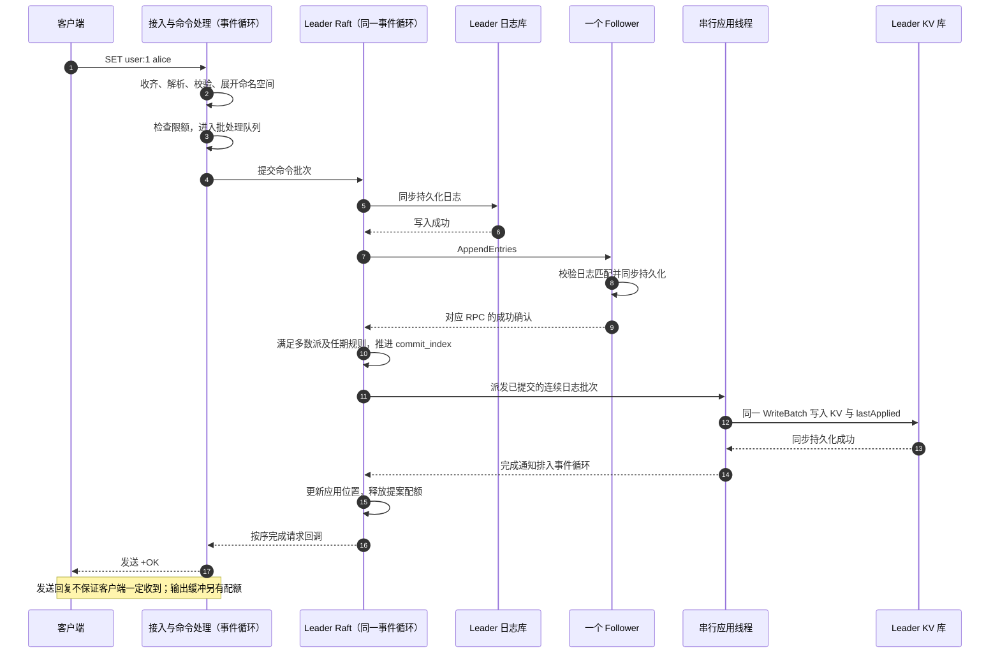

# Raft-KV 项目实践：从三节点存储到故障验证与性能优化

> 本文介绍一个 C++ 分布式 KV 学习项目的实现范围、工程改造、测试结果与后续计划，并持续记录版本更新。项目在早期参考代码和教程的基础上发展而来，已有实现与后续改造分别说明，所有实测结论都限定到对应版本、环境和故障范围。

文章整理日期：2026-09-14。正文归档版本：[`051ca62934301a22df21c03e7ba37299b161ff0b`](https://github.com/Die4U23/Raft-KV/tree/051ca62934301a22df21c03e7ba37299b161ff0b)。实验的执行版本各不相同，下文另列；文章归档提交不能替代测试时的源码和二进制身份。

阅读导航：[项目动机](#一为什么做这个项目) · [能力与边界](#二项目目前能做什么) · [系统架构](#三系统架构一次请求经过哪些模块) · [写入成功条件](#四一次写入什么时候才能返回成功) · [可靠性改造](#五围绕可靠性做了哪些改造) · [测试与证据](#六如何验证让结论有原始证据) · [重连优化](#七一次有效的优化抑制反复断线后的重连开销) · [客户端对照](#八一次未观察到收益的优化合并客户端回复头部读取) · [性能数字](#九如何理解项目的性能数字) · [后续计划](#十接下来准备提高什么) · [更新日志](#十一持续更新日志) · [项目与参考资料](#十二项目入口与参考资料)。

## 一、为什么做这个项目

我做这个项目，希望把 C++ 网络服务、Raft 共识、持久化与故障恢复放进同一条请求链路里理解。单独阅读某个模块时，很容易知道接口如何调用，却说不清一个客户端收到成功之前，系统究竟完成了哪些工作。一旦把多个节点连起来，连接中断、磁盘写入失败、Leader 切换和请求超时就会共同影响结果。

KV 存储适合承载这类练习。它的业务接口相对简单：保存一个键值、读取一个值、删除一个键。业务逻辑足够小，就可以把精力放到更难的工程问题上：怎样保留 TCP 分片输入，怎样让副本按相同顺序执行命令，怎样恢复应用进度，以及怎样避免在高负载下无限积压请求。

这与 C++ 后端、搜索广告推荐基础架构中的网络接入、配置与元数据存储、服务可靠性和性能诊断有直接关联。比如策略配置需要明确版本，服务重启后需要恢复状态，调用方重试时需要知道上一次操作是否生效。本文项目提供的是这些系统问题的实践基础。本分支用 `CFGSET`、`CFGGET`、`CFGROLLBACK` 演示按版本发布和回滚，`CFGCACHE` 只在本地缓存还新鲜时返回。推荐模型、召回和排序算法不在当前实现范围内。

### 项目来源、许可证与改造范围

目前维护的仓库是 [Die4U23/Raft-KV](https://github.com/Die4U23/Raft-KV)，采用 C++17、Muduo、Protobuf 和 RocksDB，默认运行一个固定成员的三节点 Raft 组。

这个项目是在学习 Raft 与分布式系统的过程中逐步搭建和完善的。当前能够确认的算法资料、第三方组件、设计参考与曾尝试方案如下：

| 参考项目 | 地址 | 用途 |
|---|---|---|
| **Raft 论文** | https://raft.github.io/raft.pdf | Raft 算法权威文档 |
| **Raft 可视化** | https://raft.github.io/ | 帮助理解选举与日志复制 |
| **muduo** | https://github.com/chenshuo/muduo | 网络层 |
| **RocksDB** | https://github.com/facebook/rocksdb | 存储引擎 |
| **etcd** | https://github.com/etcd-io/etcd | 成熟 Raft 应用，思路参考 |
| **TiKV** | https://github.com/tikv/tikv | Raft + RocksDB 工业实践 |
| **braft** | https://github.com/baidu/braft | 曾尝试，环境兼容性差，已放弃 |
| **NuRaft** | https://github.com/eBay/NuRaft | 曾尝试，API 变动大，已放弃 |

早期学习、技术选型和系统设计参考了上述资料与项目，具体用途如表中所列。本文不将第三方组件、Raft 算法或成熟系统的公开设计归为个人原创。感谢这些开源项目及其维护者提供的学习资源。

目前可追溯的工程改造，以仓库 `raft-cluster-namespace` 分支的以下提交为起点：

- [改造前完整代码：`bc853d5`](https://github.com/Die4U23/Raft-KV/tree/bc853d5fe8d0ffddbadbe736ccfe5100c7610b8c)。
- [改造前 README](https://github.com/Die4U23/Raft-KV/blob/bc853d5fe8d0ffddbadbe736ccfe5100c7610b8c/README.md)。
- [从基线到本文归档版本的完整差异](https://github.com/Die4U23/Raft-KV/compare/bc853d5fe8d0ffddbadbe736ccfe5100c7610b8c...051ca62934301a22df21c03e7ba37299b161ff0b)。

基线已经包含网络接入、Raft 共识、状态机、RocksDB 存储及命名空间等模块。本文重点介绍此后开展的正确性修复、故障恢复验证、请求处理改进、重连退避优化，以及性能诊断与对照实验。这个基线用于界定本次改造的起点，不构成对更早代码来源或原创归属的认定。

**许可证：** 本项目采用 MIT License 开源许可证。详见项目根目录的 LICENSE 文件。第三方依赖保持其各自的许可证。

## 二、项目目前能做什么

“已实现”说明代码中存在这条路径；“已验证”还需要回答在哪个版本、什么环境、哪些输入和故障下检查过。二者需要分开阅读。

| 能力 | 实现状态 | 已有验证 | 当前边界或计划 |
| --- | --- | --- | --- |
| `SET`、`GET`、`DEL` | 已实现；`DEL` 按键是否存在返回 1 或 0 | 本地协议/核心测试，Linux 三节点冒烟 | 支持项目定义的命令子集，不是完整 Redis 服务 |
| 命名空间 | 已实现；`SELECT` 选择当前连接的命名空间 | 同连接命令顺序及空间隔离检查 | 新连接默认 `default`；只是逻辑键空间划分，不含权限和资源隔离 |
| 选举、日志复制、多数派提交 | 已实现。默认仍是一个 Raft 组，启动时静态 peer 都是投票者。本分支可以一次加减一个投票者，`MEMBER JOIN id host port` 可以加入静态列表之外的主机，也可以用 `--shards` 在同一组 peer 上跑多个 Raft 组 | 真实三进程冒烟仍是默认单组。进程内 `cluster_features_tests` 覆盖离开后的投票者、Leader 移除自己、按地址加入、Follower 把成员变更转给 Leader，以及快照安装后被移出的节点不再竞选 | 一次只能有一个成员变更，不能把集合减空。各分片各自选主；本节点不是该分片 Leader 时把 `MEMBER` 转过去。默认 `--shards=1` |
| RocksDB 存储与应用位置恢复 | 已实现；KV 与 `lastApplied` 同批同步写入 | 本地错误注入与恢复测试，Linux 进程强制退出后恢复 | 要使用配套数据目录；没有整机掉电或设备损坏实测 |
| 批量写入、串行异步应用 | 已实现；异步应用默认开启 | 顺序、回调、配额测试及真实 Linux 运行 | Raft 日志写入与本地读仍可能阻塞事件循环 |
| 过载保护 | 已实现；限制连接、队列、提案及缓冲字节 | 指定阈值下的准入拒绝、`BUSY`、恢复清零和约 60 秒观察 | 应用配额不是进程内存上限，短时观察不等于长期稳定 |
| `INFO` 与阶段耗时 | 已实现；角色、任期、提交/应用位置、队列和耗时计数 | 阶段差分、CPU 和报告身份核验 | 没有 Prometheus 导出，阶段计数器不提供请求延迟直方图 |
| ReadIndex 强一致读 | 已实现。`--linearizable_reads` 默认关闭 | 进程内探针测试，以及 Linux 工作流里的隔离旧 Leader 检查 | 默认 `GET` 仍是本地读 |
| 请求去重 | 已实现。带 `client_id` 和 `request_id` 的写入重试返回上次回复 | 进程内重复 `DEL`、换 Leader 和快照安装后的重试 | 每个客户端只保留最新序号。`--require_request_id` 默认关闭；关闭时不带序号的写入仍会再执行 |
| 快照、日志回收、动态成员变更 | 快照按 1 MiB 分片键存放。成员变更是 joint consensus，投票者随 InstallSnapshot 带走。`MEMBER JOIN id host port` 可以加入新主机 | 可移植 CTest 覆盖快照分片、分片收齐、缺片拒绝、旧版本 1 镜像重开、成员离开、自移除和按地址加入 | 一次一个变更。发送未完成时不压缩。旧的版本 1 快照元数据仍把整份镜像读进内存 |

实现入口见[归档源码](https://github.com/Die4U23/Raft-KV/tree/051ca62/src)，验证依据见[本地改造记录](https://github.com/Die4U23/Raft-KV/blob/051ca62/LOCAL_REVIEW_STATUS.md)及第六节逐项报告。

尤其需要说明：**`GET` 直接读取当前节点的状态机。即使设置 `leader_only_reads=true`，也只是检查本机当前记录的角色，没有完成强一致读所需的多数派确认与应用等待。** 网络隔离中的旧 Leader 可能还不知道多数派已经选出了新 Leader，因而可能返回旧值。线程安全、写入多数派提交和只允许 Leader 读，分别解决不同问题。

## 三、系统架构：一次请求经过哪些模块

写请求的主路径是：客户端 → Muduo 接入层 → 命令处理 → Raft → 状态机 → RocksDB。读请求则从命令处理进入本地状态机，不经过 Raft 的读屏障。



各模块的职责如下：

| 模块 | 在项目中的职责 |
| --- | --- |
| Muduo | 管理 TCP 连接、输入输出缓冲与事件循环，驱动客户端命令和节点间消息处理 |
| Protobuf | 定义和序列化投票、日志复制等节点间消息；消息外仍需要项目自己的 TCP 帧边界 |
| Raft | 管理任期、投票、日志匹配、复制进度和多数派提交，不直接解释业务键值 |
| 状态机 | 按日志顺序把已提交命令转换为确定的 KV 修改和回复 |
| RocksDB | 分别保存 Raft 日志/硬状态，以及业务数据/应用位置 |

这些分工可以对照 [Muduo 官方仓库](https://github.com/chenshuo/muduo)、[Protobuf 概览](https://protobuf.dev/overview/)及[项目服务入口](https://github.com/Die4U23/Raft-KV/blob/051ca62/src/server/main.cpp)阅读。

这里的关键是线程归属。事件循环线程负责网络回调、批量调度、Raft 状态变化以及应用完成通知；默认启用的工作线程只负责已提交批次的 KV 应用。工作线程不会独立推进 Raft 提交位置，也不会直接操作客户端连接。

同一个 RaftNode 同时最多有一个应用批次在途。“在途”包含工作线程已经做完、但事件循环尚未处理完成通知的时间。这样可以保持批次顺序，避免后面的应用越过前面的应用。

**异步应用没有把所有磁盘工作移出事件循环。** Raft 日志与硬状态读写、准备应用批次时读取日志，以及客户端本地 `GET` 仍在事件循环线程执行。它们仍可能影响心跳和网络处理。`async_apply=false` 则把 KV 应用也放回事件循环，作为同步执行的对照路径。机制见[并发处理说明](https://github.com/Die4U23/Raft-KV/blob/051ca62/docs/concurrency.md)；该早期文档中的“未运行”文字属于历史状态，当前验收情况以第六节带日期的报告为准。

## 四、一次写入，什么时候才能返回成功

以一个发送到 Leader 的 `SET user:1 alice` 为例，成功路径如下。图中仅展开一个 Follower 的确认；正常情况下 Leader 向两个 Follower 发起复制。



具体来说，请求先经过完整性、参数及大小校验，再检查连接状态、Leader 角色和队列容量。命名空间会在这时展开到业务键中，展开后的完整命令也必须满足大小限制。

写队列默认使用 `group_commit_ms=1` 的收集期限，满批则提前排入事件循环。当前组批阈值为 128 条或 1 MiB 命令数据。这个 1 毫秒是调度目标，实际等待还受事件循环与磁盘工作影响；设置为 0 也可能合并同轮到达的请求。

Leader 将日志批次同步写入自己的日志库，再通过 Raft RPC 复制。三节点中的多数派是两个节点：对正常的新写入，Leader 自身和一个 Follower 持久化成功，就可能满足数量要求。代码还必须验证回复对应的请求、日志位置与任期条件，不能把任意两次 ACK 当成多数派。Raft 对当前任期条目的提交规则，也不能省略。

提交之后，状态机才依次执行命令。KV 数据和该批次最后一个日志位置 `lastApplied` 在同一个同步 `WriteBatch` 中保存。工作完成通知回到事件循环后，Raft 才更新自身的应用位置，释放未完成提案配额，并调用成功回调。对应实现见 [`RaftNode::FinishApply`](https://github.com/Die4U23/Raft-KV/blob/051ca62/src/raft/raft_node.cc)与[存储批量应用](https://github.com/Die4U23/Raft-KV/blob/051ca62/src/storage/rocksdb_store.cpp)。

三种状态的含义不同：

| 状态 | 已经发生的事情 | 此时不能据此断言什么 |
| --- | --- | --- |
| 日志已经写入 | 某个节点保存了这条日志 | 单节点保存不代表形成多数派；未提交的冲突日志仍可能被后续 Leader 覆盖 |
| 日志已经提交 | 已满足 Raft 提交规则，可以按顺序应用 | 业务 KV 可能还没更新；各 Follower 的应用进度也可能不同 |
| 日志已经应用 | 该节点执行了命令；本项目要求业务修改与应用位置保存成功 | 不能保证客户端收到回复，也不能保证所有副本已经应用到同一位置 |

因此通常有 `last_applied ≤ commit_index ≤ last_log_index`。异步模式下看到 `commit_index` 领先于 `last_applied`，意味着存在已提交但尚未完成应用通知处理的日志，不应立即判断为副本错误。日志提交与客户端交互的算法背景见 [Raft 论文第 5、8 节](https://raft.github.io/raft.pdf)。

配额也分阶段释放：写队列条目出队时释放队列配额，应用完成时释放对应的未完成提案配额，网络输出积压另行跟踪。不能把“写请求结束”理解为所有缓冲已经送达对端。

### 客户端超时为什么不代表失败或撤销

客户端可能在日志写入前断开，也可能在日志已经提交、业务已经应用后，因回复丢失而超时。服务端不会因为调用方不再等待，就回滚已经进入 Raft 的命令。

这不是只有理论上的可能性：[重连优化后的分区报告](https://github.com/Die4U23/Raft-KV/blob/051ca62/docs/benchmarks/reconnect-validation.md)中，`no-quorum-2` 在故障窗口内没有得到成功确认，被记为结果未知，恢复通信后却被应用。正确记录应当同时保留这两个事实，不能把它改记为“故障期间写入成功”或“超时必定失败”。

项目尚无请求去重。调用方重试时，可能产生另一条日志；即使重复 `SET` 相同值最终看起来一样，重复 `DEL` 的返回值也可能由 1 变成 0。因此，重试语义需要单独设计。

## 五、围绕可靠性做了哪些改造

下面按“基线已有 → 问题 → 本次改动 → 验证 → 剩余边界”介绍，避免把使用了某个组件直接写成个人新增能力。

### 5.1 协议与请求处理

**基线已有：** Muduo 客户端接入、RESP 命令解析、基本命令分发以及连接级命名空间。

**问题：** TCP 提供字节流，一次接收回调不一定包含一条完整命令。基线从 Muduo 缓冲中取走全部当前数据后解析，未完整命令可能丢失；一次到达多条命令时，还要防止后续本地 `GET` 或 `SELECT` 越过正在等待提交的写请求。

**本次改动：** 为连接保留未消费输入，解析器明确区分 `Complete`、`NeedMore`、`Invalid`。只有完整命令才消费对应字节；半条命令继续等待后续输入；非法长度、参数和结束符进入错误处理。补充整数长度、参数数量、命令大小与命名空间展开后的限制。每轮最多解析 128 条命令，然后交回事件循环。

例如同一连接连续发送 `SET k v`、`GET k`、`SELECT other`，服务端会等前面的写请求完成后继续处理后续命令。当前每连接最多有一个等待结果的写请求，跨连接写入仍可合批。`SELECT` 的状态只属于该连接，两次单独运行客户端不会共享它。

**验证：** 本地协议目标覆盖分片拼接、连续命令、输入上限和错误边界；早期记录包含 274 项协议检查及 10,000 条命令连续解析。真实 Linux 冒烟进一步检查分片、二进制内容、跨轮流水线与命名空间。入口见[解析器](https://github.com/Die4U23/Raft-KV/blob/051ca62/src/common/resp_parser.h)、[命令缓冲](https://github.com/Die4U23/Raft-KV/blob/051ca62/src/common/command_buffer.h)和[测试说明](https://github.com/Die4U23/Raft-KV/blob/051ca62/tests/README.md)。RESP 长度和回复格式可对照 [Redis 协议规范](https://redis.io/docs/latest/develop/reference/protocol-spec/)。

**剩余边界：** 本项目只实现所需命令和回复子集。`-ERR MOVED <leader_id>` 是项目自定义错误，不是 Redis Cluster 的完整重定向协议；同连接处理顺序也不能替代全局强一致读。

### 5.2 持久化与恢复

**基线已有：** RocksDB 日志存储、KV 存储封装和顺序状态机应用路径。基本的“提交后应用，再触发回调”结构原本已经存在。

**问题：** 基线的 KV 存储返回读写是否成功，但状态机没有据此阻止成功回复；读取错误也可能与键不存在混在一起。应用位置只保存在内存时，重启后难以可靠判断哪些日志已经改变了业务数据。

**本次改动：** 检查持久化返回状态，真实读取错误不伪装成键不存在，日志或硬状态保存失败不确认成功。将业务修改与该批次的 `lastApplied` 放进同一个同步 `WriteBatch`，存储成功后才发布应用进度。状态机先校验整批命令，再写入；批内重复操作保持顺序，例如 `SET k v / DEL k / DEL k` 分别返回 `OK / 1 / 0`。

假设日志 41、42 已经提交：若只保存业务数据而没有保存应用位置，重启可能重复应用；若只先保存位置，恢复又可能跳过未写入的数据。同批保存让恢复时的 KV 内容与应用标记来自同一次原子更新。RocksDB 的 `WriteBatch` 和 `sync` 分别对应批量原子更新及同步写入要求，具体说明见 [RocksDB Basic Operations](https://github.com/facebook/rocksdb/wiki/Basic-Operations)。

此外，本次改造还修正了共识路径中的若干边界：重复投票不重复计数，RPC 回复按请求身份匹配，日志前缀不匹配时不误删日志，不允许冲突覆盖已经提交但尚未应用的条目。这些属于对已有 Raft 实现的正确性修复，详细场景见[本地核心验证记录](https://github.com/Die4U23/Raft-KV/blob/051ca62/LOCAL_REVIEW_STATUS.md)。

**验证：** 存储替身覆盖同步写入选项、批内语义、写入失败、应用位置不误推进及重启补应用；真实 Linux 测试检查进程 `SIGKILL` 后从原目录恢复，以及已确认数据的保留。

**剩余边界：** Raft 日志库与 KV 库是两个独立数据库，不能把上述同批写入理解为跨库事务。恢复需要同一个节点配套的 `db_path` 和 `raft_log_path`；不能随意混用不同节点、不同时间点的目录。旧版非空 KV 库若缺少应用标记，当前会拒绝启动，应该保留旧数据并使用新的配套目录验证。当前也不支持混合版本滚动升级。同步写入的代码约定与进程崩溃测试，均不能替代整机掉电和真实磁盘故障验证。

### 5.3 异步应用与过载保护

**基线已有：** 在事件循环中执行已提交命令的路径，以及保存写请求回调的结构。

**问题：** KV 同步应用会占用事件循环；另一方面，把工作移到线程里，如果没有顺序约束、容量限制和生命周期设计，又会引入乱序、无限积压或回调访问已销毁对象的问题。

**本次改动：** 增加批量提案、串行工作线程和完成通知。工作线程仍使用同步持久化，异常回到事件循环后触发停止服务，不对落盘结果不确定的批次返回成功。待决请求的条数与字节一直保留到相应完成处理；连接回调使用弱引用，应用通知和定时任务检查对象生命周期或代际标记，防止旧回调继续操作新状态。

退出时停止接收新的应用任务，等待已接收任务结束并回收工作线程，然后再销毁其依赖；晚到的完成通知不能访问已析构的 RaftNode。这里验证的是具体执行器与对象生命周期路径，仍需要补充更广泛的进程信号和异常退出专项覆盖。

| 受限位置 | 当前限额 | 超限处理 |
| --- | --- | --- |
| 客户端连接 | 默认 1024，可配置 | 关闭新增连接 |
| 单条命令 | 1 MiB，含协议与命名空间展开 | 拒绝超大命令 |
| 客户端未消费输入 | 单连接 4 MiB，合计 64 MiB | 关闭继续超量输入的连接 |
| 客户端待发送输出 | 单连接 4 MiB，合计 64 MiB | 关闭慢客户端 |
| 等待组批的写队列 | 1024 条、16 MiB | 返回 `ERR BUSY` |
| Leader 未完成提案 | 1024 条、16 MiB | 整批拒绝并返回 `ERR BUSY` |
| 每个 Raft 对端待发送数据 | 4 MiB | 暂缓整帧发送，由重发机制再尝试 |

这张表描述应用层的准入与积压控制。RocksDB 缓存、对象、系统 socket 缓冲和日志仍占用资源，所以这些数字不等于 RSS 上限；所有超限也并非统一返回 `BUSY`。

**验证：** 可移植核心测试控制“提交、工作线程执行、完成通知处理”的先后，检查只有一个应用批次在途、顺序推进及配额释放；线程执行器测试实际创建标准库线程。Linux 过载实验再检查拒绝、恢复和资源变化，具体结果见下一节。[串行执行器](https://github.com/Die4U23/Raft-KV/blob/051ca62/src/raft/serial_apply_executor.cc)和[服务端配额实现](https://github.com/Die4U23/Raft-KV/blob/051ca62/src/server/main.cpp)提供代码依据。

**剩余边界：** 当前测试证明的是指定阈值和短时间负载下的行为，没有覆盖所有慢客户端、长期资源增长或极限容量条件。异步应用的性能效果也必须实测，不能仅凭线程数量增加就认定吞吐提升。

## 六、如何验证：让结论有原始证据

本项目把验证分成三个层次。它们相互补充，但不能相互替代。

| 验证层次 | 主要回答的问题 | 证据与局限 |
| --- | --- | --- |
| 本地核心测试 | 分片输入、重复 ACK、冲突日志、存储错误、应用延迟等边界是否按预期处理 | 使用实际核心源码和可控存储/网络替身；执行器另用真实标准库线程。不能证明真实磁盘与 TCP 行为 |
| 真实 Linux 集成测试 | 实际 Muduo、Protobuf、RocksDB 和三个进程能否协同运行 | 保留编译、CTest、冒烟及运行时身份记录；同机环境有明确限制 |
| 故障与性能实验 | 指定故障下是否错误确认、恢复后数据是否保留、改动是否带来可观察收益 | 保留配置、日志、请求账本或客户端报告、源码指纹、二进制指纹记录及核验输出 |

早期可移植 CTest 有 5 个目标；增加重连策略后，Windows 记录为 6/6；重连版本的 Linux CTest 为 7/7，包含真实 Muduo 连接生命周期测试。这些分母来自不同版本和构建条件，不能合并成一次测试结果。

### 已完成的真实场景

| 场景 | 主要检查 | 归档结果 | 对应证据 |
| --- | --- | --- | --- |
| 三节点冒烟 | 选主、分片请求、流水线、命名空间、并发连接、复制与原目录恢复 | 多轮构建验收均有 10 项 PASS；重连版本最终三节点提交/应用位置均为 42 | [重连版本构建与冒烟](https://github.com/Die4U23/Raft-KV/blob/051ca62/docs/benchmarks/reconnect-validation.md) |
| 短时 TCP 分区 | 少数派不成功确认新写入；多数派继续工作；完全失去多数派时提交/应用不推进 | 原分区实验 5 个阶段 PASS、81 份 INFO 快照；4 个探测请求没有成功确认 | [分区报告](https://github.com/Die4U23/Raft-KV/blob/051ca62/docs/benchmarks/partition-validation.md) |
| 持续写入时 Leader 退出 | 故障期间客户端继续尝试，新 Leader 接管后继续确认写入，旧节点恢复后追平 | 5 个阶段 PASS；1,704 个已确认键在两次恢复后的三个副本中均保留 | [写入与重启报告](https://github.com/Die4U23/Raft-KV/blob/051ca62/docs/benchmarks/write-restart-validation.md) |
| 过载与短时持续运行 | 连接准入、写入积压拒绝、恢复清零、有限窗口资源变化 | 4 个阶段 PASS；5 个超额连接关闭、4 次明确 BUSY；约 60 秒正式观察及卸载后清零通过 | [过载报告](https://github.com/Die4U23/Raft-KV/blob/051ca62/docs/benchmarks/overload-validation.md) |

分区脚本通过 TCP 转发器控制节点间的有向连接。隔离阶段核对跨分区边的转发字节没有增长，同时记录各节点的角色、任期、提交位置和应用位置。旧 Leader 还自称 Leader，并不表示它能够形成多数派或确认新写入；观察重点是实际提交和客户端结果。

持续写入实验单独保留请求账本：

| 请求分类 | 数量 | 判定方式 |
| --- | ---: | --- |
| 客户端确认成功 | 1,704 | 两次恢复后，三个副本逐键检查精确值 |
| 明确拒绝 | 64 | 保留 MOVED/BUSY 等拒绝结果，不计入成功 |
| 结果未知 | 8 | 请求已发送但未读取到回复，不能假定失败或撤销 |
| 未发送 | 56 | 发送前连接失败，单独记录 |
| 合计 | 1,832 | 序号连续、键唯一，没有针对同一个键重试 |

在本轮中，8 个未知请求恢复后均不存在，但这只是本轮结果。测试先在持续写入期间强制退出 Leader，再恢复该节点；**全体节点同时强制退出发生在持续写入停止、第一次数据核验完成之后。** 因此不能把它表述为“持续写入时整个集群同时崩溃的验证”。完整时序见[请求账本与故障记录](https://github.com/Die4U23/Raft-KV/blob/051ca62/docs/benchmarks/write-restart-validation.md)。

过载实验把 `max_clients` 设为 32，其中一个名额用于监控；没有据此验证默认 1024 连接的实际承载能力。隔离期间，24 个客户端各发送一个 800 KiB 值，得到 4 次 BUSY 和 20 次结果未知。恢复后再进入固定键短时负载，卸载后的 10 份采样显示队列、待处理提案、输入输出积压和应用滞后为零。

该轮三个节点的稳态 RSS 增长约为 0.777、0.385、0.777 MiB，FD 增长均为 0。这里的增长使用正式阶段末 10 份与前 10 份采样的中位数差；采样峰值可能遗漏瞬时峰值。该负载还主动间隔发送，属于资源观察，不能拿包含预热的请求总数除以 60 秒生成正式吞吐。定义与阈值见[过载原始报告](https://github.com/Die4U23/Raft-KV/blob/051ca62/docs/benchmarks/overload-validation.md)。

### 测试结论的边界

三进程同机能够验证真实网络和存储依赖参与的特定行为，但三个进程共享宿主机、电源、磁盘和调度资源，不能称为三机容灾实测。`SIGKILL` 终止进程，没有模拟整机断电或设备损坏；60 秒观察也不能证明长期无泄漏。

当前分区验证覆盖短时、对称的 TCP 断连/拒绝连接场景，尚未覆盖静默丢包、非对称分区等完整网络故障空间。测试里的本地读通常在等待恢复和应用收敛后执行，不能由此证明并发历史的线性一致性。

归档中的源码清单、文件哈希与二进制哈希记录提高了可追溯性，但包内未必包含二进制和数据库本体，也没有每次 GET 的独立请求/回复转录。核验可以重算已有数据、检查脚本与报告对应关系，不能补出当时没有记录的证据，更不等于第三方独立运行或完整正确性证明。

本文整理时重新运行了八项只读归档核验：自动构建、空目录构建、分区、持续写入重启、过载、重连退避、正常负载诊断和客户端读取对照，均为 PASS。这一步核对已有材料，没有重新执行 Linux 集群或产生新的性能实验。

## 七、一次有效的优化：抑制反复断线后的重连开销

### 问题与定位

原分区实验的安全性检查通过了，但同时出现了另一个问题：TCP 转发器累计拒绝新连接 **24,731 次**，三个节点的完整日志达到 **5,498,325 字节**。故障期间没有错误确认新写入，并不意味着连接处理开销合理。

排查时，需要把两种情况区分开：一是连接一直没有建立成功，二是 TCP 已经建立，随后被对端立即关闭。原有 Connector 对建连失败已有退避；本次转发器会先接收 TCP 连接再关闭，触发的则是 TcpClient 已建连后的断线重连路径。项目原先启用了立即重连，因而在这种反复断线场景里快速创建连接并输出日志。

另一个过载实验曾出现 7,897 次拒绝重连，但负载和故障配置不同，本文不把它作为这次分区对照的基线。问题和调用路径见[重连优化记录](https://github.com/Die4U23/Raft-KV/blob/051ca62/docs/optimizations/peer-reconnect-backoff.md)。

### 实现

本次在项目的 PeerManager 中调整已建连后的重试策略，没有修改原始 Muduo 依赖压缩包：

1. 每个 peer 独立保存重试状态，断线后的等待按 **500 → 1000 → 2000 毫秒**增长，之后保持 2000 毫秒。
2. 连接连续存在满 **10 秒**才重置退避，避免“刚连上就断开”不停回到最短等待。
3. 用代际标记识别旧定时任务，处理重复回调和重复启动，并让对象销毁后的回调失效。
4. 建连失败仍交给 Connector 原有退避，不在它已经连接或正在重试时重复调用连接入口。

代码入口是[重试策略](https://github.com/Die4U23/Raft-KV/blob/051ca62/src/common/peer_retry_policy.h)和 [PeerManager](https://github.com/Die4U23/Raft-KV/blob/051ca62/src/raft/peer_manager.cc)。策略测试检查上限、稳定重置边界和 peer 状态独立；Linux 真实传输测试检查建连拒绝、建立后反复关闭、恢复后接收 Raft 帧，以及等待重连时销毁对象。

### 本次实测

| 指标 | 旧版 `9cfcfd6` 对应实验 | 新版 `ef17ef7` 对应实验 | 本次变化 |
| --- | ---: | ---: | ---: |
| 转发器拒绝重连次数 | 24,731 | 11 | 约减少 99.96% |
| 三节点完整日志量，包含清理 | 5,498,325 字节 | 146,110 字节 | 约减少 97.34% |
| 两次实际隔离窗口 | 4.322 / 4.032 秒 | 4.293 / 4.087 秒 | 时长接近但不完全相同 |

新版同时通过 Linux 构建、CTest 7/7、三节点冒烟 10 项和分区 5 个阶段。少数派不能成功确认新写入、失去多数派时提交/应用位置冻结，以及恢复后收敛的检查均通过。原始材料与复算方法见[重连实测报告](https://github.com/Die4U23/Raft-KV/blob/051ca62/docs/benchmarks/reconnect-validation.md)。

日志量采用两边完整文件的大小。新版报告在结束清理前采样得到的是 146,022 字节，完整文件是 146,110 字节；若一边用快照、一边用完整文件，就会混用口径。

### 取舍

退避降低了本次故障场景中的反复建连与日志开销，也可能增加恢复等待。项目自己的断线等待上限是 2 秒；随后若建连仍失败，还会进入 Connector 原有、最长 30 秒的退避，不能据此承诺“两秒内恢复”。

两轮初始 Leader 分别为 0 和 1，选举、调度和故障窗口并不完全相同。这是一次同类场景前后比较，不能解释为所有环境都能获得相同比例收益。整轮测试耗时包含隔离、选举、标记写入、核验和清理，也不能当作 TCP 重连延迟。

本次有直接证据支持的收益是**拒绝重连次数与完整日志量下降**。没有 CPU 和正常业务吞吐对照，因而不据此宣称业务 QPS 提升。

## 八、一次未观察到收益的优化：合并客户端回复头部读取

### 为什么尝试

后续正常负载诊断发现，客户端消耗约 12.22 CPU 秒，约占单核 62.88%；整机平均 CPU 空闲约 4.97%。三个服务节点和负载进程同机，客户端本身也是资源竞争的一部分。但当时还没有函数级热点证据，不能认定客户端某个解析函数就是唯一瓶颈。

一个小范围尝试是合并 RESP 回复头部读取：`classic` 先读取类型字节，再读取头部行；`combined-header` 将二者合为一次 StreamReader 读取，尝试减少方法调用次数。它没有把任意完整回复合成一次读取，带正文的回复仍需按长度读取后续内容，也不保证底层系统调用次数一定减少。改动范围见[客户端实验说明](https://github.com/Die4U23/Raft-KV/blob/051ca62/docs/optimizations/client-overhead.md)。

### 如何对照

四轮顺序为 **classic → combined-header → combined-header → classic**，即 A→B→B→A。这样可以把两种模式分散到测试前后，减少只比较相邻两轮时受时间趋势影响的风险，但不能消除虚拟机调度和同机资源竞争。

四轮使用同一个服务端二进制，32 连接、`pipeline=1`、128 字节 value、读写各半；每轮预热 10,000 次，正式请求 100,000 次。`async_apply=true`、`group_commit_ms=1`，同步持久化和多数派确认语义保持一致。合计 **400,000 次正式请求，零错误**。

### 完整结果

| 轮次 | 模式 | 初始 Leader | 成功吞吐（次/秒） | P99（毫秒） | 客户端 CPU 成本（微秒/次） |
| --- | --- | ---: | ---: | ---: | ---: |
| 1 | classic | 0 | 7117.85 | 9.223 | 108.2 |
| 2 | combined-header | 1 | 7405.43 | 10.218 | 104.8 |
| 3 | combined-header | 1 | 5957.23 | 11.685 | 138.8 |
| 4 | classic | 1 | 6338.65 | 16.918 | 119.2 |

| 按模式合并的指标 | classic | combined-header | 相对 classic 的变化 |
| --- | ---: | ---: | ---: |
| 正式成功请求 | 200,000 | 200,000 | — |
| 正式总耗时 | 29.8254 秒 | 30.2899 秒 | — |
| 合并成功吞吐 | 6705.69 次/秒 | 6602.85 次/秒 | −1.53% |
| 客户端 CPU 时间 | 22.74 CPU 秒 | 24.36 CPU 秒 | +7.12% |
| 客户端 CPU 成本 | 113.7 微秒/次 | 121.8 微秒/次 | +7.12% |

数据来自[客户端头部读取 ABBA 报告](https://github.com/Die4U23/Raft-KV/blob/051ca62/docs/benchmarks/client-header-validation.md)。合并吞吐按“总成功数 ÷ 总正式耗时”计算，CPU 成本按“总客户端 CPU 时间 ÷ 总成功数”计算。不能直接平均两个 QPS，也不将四轮 P99 平均成一个“合并 P99”。

### 结果与决定

本轮合并模式的吞吐下降约 1.53%，客户端 CPU 成本增加约 7.12%，没有观察到预期收益，所以继续保留 `classic` 默认；`combined-header` 留作显式实验选项。

这不意味着它在所有环境中必然更慢。第 2、3 轮使用相同模式和相同 Leader，吞吐仍明显波动。如果只选择第 2 轮，就可以拼出一个看起来有效的优化故事，但它忽略了同一实验里相反的结果。

这次实验完成的是一个有边界的决策：小范围改动经过完整对照，没有取得足够的收益证据，因此不切换默认，也不继续重复同配置挑选最快轮次。后续若继续优化，应先补函数级热点或隔离客户端争用的测量。

## 九、如何理解项目的性能数字

### 先说明环境与负载

本文重点使用的正常负载诊断和客户端 ABBA 实验来自双核 Ubuntu 26.04 VM，记录内核为 `7.0.0-31-generic`、Python 为 3.14.4，三个服务进程与一个负载进程同机运行。它们共享有限 CPU、内存和存储资源，不能视为独立服务端容量测试。

| 条件 | 本文正常诊断与客户端对照的设置 |
| --- | --- |
| 连接数 | 32 |
| Pipeline | 1，即每条连接一次只等待一个操作的回复 |
| Value 大小 | 128 字节，不含键、协议头及复制开销 |
| 读写比例 | 50% SET / 50% GET |
| 每轮预热 / 正式请求 | 10,000 / 100,000 |
| 应用方式 | `async_apply=true` |
| 组批窗口 | `group_commit_ms=1` |
| 持久化 | 保留同步写入 |
| 读取语义 | 本地 GET |

对应环境记录见[正常诊断报告](https://github.com/Die4U23/Raft-KV/blob/051ca62/docs/benchmarks/profile-validation.md)和[客户端对照报告](https://github.com/Die4U23/Raft-KV/blob/051ca62/docs/benchmarks/client-header-validation.md)。这些条件不能自动套用到分区、过载实验或更早的同步/异步 ABBA。

### 吞吐、错误率与 P99 分别说明什么

成功吞吐表示正式窗口内，每秒完成了多少个成功请求。本地 GET 和需要复制持久化的 SET 成本不同，读写混合结果不能直接称为纯写吞吐。错误率需要同时保留拒绝、断连、超时等分类，不能为了提高成功吞吐而把失败请求从总请求统计中隐去。

P99 描述报告所收集延迟样本的第 99 百分位，用来观察尾部等待，不是最坏延迟。该压测工具按批次统计延迟；本轮 `pipeline=1`，一个完整批次只有一次操作，才可以按这个前提理解其数值。未来改为 `pipeline>1` 后，不能继续把整批延迟写成单请求延迟。

一轮正常诊断记录如下：

| 指标 | 本轮结果 |
| --- | ---: |
| 正式成功 / 错误 | 100,000 / 0 |
| 正式耗时 | 19.433 秒 |
| 成功吞吐 | 5145.92 次/秒 |
| P50 / P95 / P99 | 5.242 / 14.631 / 21.663 毫秒 |
| 客户端 CPU | 12.22 CPU 秒，约占单核 62.88% |
| Leader CPU | 11.43 CPU 秒，约占单核 58.81% |
| 两个 Follower CPU | 分别约占单核 16.77% / 16.05% |
| 整机平均 CPU 空闲 | 4.97% |

这些 CPU 百分比中，进程值按“单核 = 100%”表示，整机空闲值则按整机容量表示，不能把两种分母直接混加。正式吞吐窗口排除了预填充、预热、建连和连接清理；原始报告没有保存逐次延迟序列，所以现有材料能够核对 P99 报告值及样本数，不能从原始延迟重新计算分位数。[测量窗口与数据来源](https://github.com/Die4U23/Raft-KV/blob/051ca62/docs/benchmarks/profile-validation.md)

### 为什么不能跨轮次直接计算“性能提升”

较早的[同步/异步 ABBA 基线](https://github.com/Die4U23/Raft-KV/blob/051ca62/docs/benchmarks/ubuntu-2cpu-abba.md)中，异步合并吞吐约为 3825 次/秒；之后正常诊断约为 5146 次/秒，再之后客户端实验的 classic 合并吞吐约为 6706 次/秒。

这些数字来自不同实验，测量窗口、运行时状态、工具和环境背景需要分别核对。不能把它们排成一条“持续优化提升曲线”，也不能将后来的 classic 比早期诊断更快，算到 combined-header 改动上。只有明确控制变量、保留所有轮次并使用同一统计口径，才能讨论某项改动与差异的关系。

### 为什么阶段平均耗时不能简单相加

`INFO` 的阶段计数从进程启动累计。对同一进程、没有重启的两个快照，区间平均耗时应该按 `Δtotal_us / Δcount` 计算；分母为 0 表示该区间没有样本。累计平均值相减不是区间平均，累计最大值相减也不是区间最大值。

正常诊断中的 Leader 阶段差分如下：

| 阶段 | 样本数 | 平均耗时（微秒） | 样本单位 |
| --- | ---: | ---: | --- |
| 写入排队 | 50,000 | 1080.61 | 客户端条目 |
| Leader 日志写入 | 5,681 | 118.80 | 日志批次 |
| 复制数据确认 | 11,322 | 1191.43 | 携带数据的 RPC |
| KV 应用 | 5,666 | 151.44 | 应用批次 |
| 应用完成通知派发 | 5,666 | 464.14 | 应用批次 |
| 写入完成 | 50,000 | 3608.33 | 成功完成回调的写请求 |
| 本地读取 | 50,000 | 14.89 | 本地 GET |

日志写与 KV 应用平均每批约 8.80、8.82 条。一批日志可以服务多个请求，一条 RPC 也可能覆盖多个日志；复制确认还可能来自不同 peer，阶段的统计区间又可能重叠。将表中均值相加，得到的不是任何一类真实请求的总延迟。

此外，`write_completed` 到服务端成功回调为止，不含回复到达客户端的时间；`replication_data_ack` 包含缓冲与重试，不是纯网络 RTT，也不是多数派提交耗时。定义见[并发指标说明](https://github.com/Die4U23/Raft-KV/blob/051ca62/docs/concurrency.md)，数值见[阶段差分报告](https://github.com/Die4U23/Raft-KV/blob/051ca62/docs/benchmarks/profile-validation.md)。

现有数据能够支持的判断是：本轮同机资源余量较小，客户端值得纳入诊断，阶段计数可以帮助缩小调查范围。它还不足以定位唯一瓶颈、推出独立服务端容量，或预测三台物理机及更大集群的性能。完整 JSON、日志与核验材料通过文末仓库索引提供。

## 十、接下来准备提高什么

下表是 2026-09-14 列出的五项计划。2026-09-24 按代码核对：1、4、5 已在 `cursor/raft-snapshot-386d`（`284cc2a`）实现，第 2 项在本分支 `cursor/cluster-features-386d` 实现。`main`（`531fcf4`）已有 ReadIndex 和 Pre-Vote，没有快照、去重和下面的配置命令。标签 `v0.2.0` 指向 `8f5142f`，不是 `531fcf4`。第 3 项只完成了持续集成，没有单独的干净系统复现归档。

| 优先级 | 计划 | 状态 | 对照 |
| --- | --- | --- | --- |
| 1 | **ReadIndex 强一致读** | 已完成 | `--linearizable_reads` 默认关闭。Leader 在本任期提交 no-op 后，用请求之后的 AppendEntries 确认多数派，再等 `lastApplied` 追上。CheckQuorum 让隔离旧 Leader 卸任。Linux 工作流里的 `tests/cluster_linearizable.py` 检查隔离旧 Leader 不能返回过期值 |
| 2 | **版本化策略配置演示** | 已完成 | 本分支。`CFGSET` / `CFGROLLBACK` 是 Raft 写，成功回复新版本号。同一 `client_id` 和 `request_id` 重试不升版本。回滚把旧版本的值复制成新版本。不存在的版本返回 `-ERR no such config version`，不消耗序号。`CFGGET` 是读。`CFGCACHE` 只在缓存年龄不超过 `max_age_ms` 时返回，否则 `-ERR config not fresh`。没有配置记录时快照仍是版本 2；有记录时快照版本 3 |
| 3 | **Linux CI 与演示入口** | 部分完成 | `portable.yml` 跑可移植 CTest；`linux-cluster.yml` 构建服务、跑冒烟，并跑隔离旧 Leader 的线性读。两者在 `pull_request` 和 `main` 的 push 上触发。干净机器从零安装的单独证据包、以及一份可重复的三节点演示入口，还没有归档 |
| 4 | **请求去重** | 已完成 | `SET`/`DEL` 可带 `client_id` 和从 1 连续递增的 `request_id`。结果与用户键同一批次落盘，并进入版本 2 快照。换 Leader 重试同一序号不会再执行。`--require_request_id` 默认关闭；关闭时不带序号的写入仍会再执行，打开后缺少序号返回 `-ERR request id required`。每个客户端只保留最新序号 |
| 5 | **快照与日志回收** | 已完成 | 已应用条目超过 1024 后导出 KV 镜像并截断日志。镜像按 1 MiB 分片键存放，落后副本按块安装，收齐并确认合法后才截断日志。日志快照先于 KV 落盘，重启时按块补上 KV。旧的版本 1 快照元数据仍把整份镜像读进内存 |

ReadIndex 的重点不只是增加一次心跳。需要明确何时可以相信当前读屏障，等待状态机应用到哪一个位置，以及等待期间角色变化如何结束请求。算法背景可参考 [Raft 论文第 8 节](https://raft.github.io/raft.pdf)；对外读写语义的描述方式可对照 [etcd API 一致性保证](https://etcd.io/docs/v3.6/learning/api_guarantees/)。

动态成员变更、多分片、网络身份认证和租约读已在本分支实现，默认保持原来的行为：`--shards=1`，`--cluster_token` 和 `--client_token` 为空，`--lease_reads=false`，`--require_request_id=false`。`MEMBER JOIN id host port` 可以加入静态列表之外的主机，Leader 可以移除自己。一次只能有一个变更，不能把集合减空。多分片时各分片各自选主；本节点不是该分片 Leader 时把 `MEMBER` 转给那个 Leader，还不知道 Leader 时返回 `MOVED -1`。`--cluster_token` 非空时 Raft 帧外面加 HMAC-SHA256，校验失败就关掉连接。`--client_token` 非空时，除 `AUTH` 外的命令在认证前返回 `-ERR NOAUTH Authentication required`。`--lease_reads` 在投票者联系时间的多数派加上（150 ms − 10 ms）之内把读排到当前提交位置，仍要等 `lastApplied`；窗口外退回 ReadIndex。Follower 的时钟如果快过这个漂移上界，仍可能在 Leader 认为租约有效时开始竞选。其他网络故障、真实存储故障和长期运行验证仍未做。干净系统复现证据包仍未归档。

## 十一、持续更新日志

以下按验收或归档日期倒序维护；同日记录按本次整理顺序排列。每次更新保留“问题或目标、改动、验证、结果、取舍、证据”六项。代码发布早于实测归档时，分别注明，避免把工具发布当成实验完成。

### 2026-09-24｜放宽成员变更，并按块存放快照

- **问题或目标**：上一节留下的限制是：不能加入静态列表外的主机，Leader 不能移除自己，`MEMBER` 要求本节点领导每个分片，不带序号的写入总会再执行，快照镜像在压缩和安装时整份留在内存里。
- **本次改动**：`MEMBER JOIN id host port` 记住新主机。Leader 可以 `MEMBER LEAVE` 自己，COMMIT 应用后卸任。本节点不是某个分片的 Leader 时，把 `MEMBER` 转给那个分片的 Leader。`--require_request_id` 默认关闭；打开后，缺少序号的 `SET` / `DEL` / `CFGSET` / `CFGROLLBACK` 被拒绝。新快照按 1 MiB 分片键写入日志库，压缩、发送、接收和安装每次处理一块。
- **验证环境与方法**：可移植 CTest 16/16 通过，含按地址加入、Leader 自移除、Follower 转发、快照分片收齐，以及旧版本 1 快照重开。Linux 构建 CTest 17/17 通过。`tests/cluster_smoke.py` 对这次链接的 `raft_kv_server` 10/10 通过。`cluster_linearizable.py` 这次没有重跑。
- **实测结果**：默认 `--require_request_id=false` 时，原来的可移植用例和三进程冒烟仍然通过。没有新的性能数字。
- **取舍与未完成事项**：不带序号的写入在标志关闭时仍会再执行。Follower 时钟快过 10 ms 时，租约读仍不安全。旧的版本 1 快照元数据仍把整份镜像读进内存。`main` 和 `v0.2.0` 都没有这些改动。
- **关联提交**：仍在本分支 `cursor/cluster-features-386d`。不在 `main` 的 `531fcf4`，也不在 `v0.2.0` 的 `8f5142f`。

### 2026-09-24｜版本化配置、成员变更、多分片、认证与租约读

- **问题或目标**：第十节第 2 项，以及表后的成员变更、多分片、网络身份认证和租约读，当时都还没有实现。
- **本次改动**：五项都进了本分支，默认关闭或保持空令牌、单分片。配置命令走现有 Raft 写和会话表。成员变更用 joint consensus，一次一个，投票者随快照带走。多分片在同一静态 peer 集合上各跑一组 Raft。Raft 帧可以加 HMAC-SHA256，客户端可以要求 `AUTH`。租约读只在漂移窗口内跳过新的 ReadIndex 探针，仍等待应用。
- **验证环境与方法**：可移植 CTest 16/16 通过，含 `cluster_features_tests`、配置快照往返，以及缓存、分片前缀和 HMAC 测试向量。Linux 上重新链接了 `raft_kv_server`。`.github/workflows/linux-cluster.yml` 的三进程冒烟和 `cluster_linearizable.py` 这次没有重跑。
- **实测结果**：默认 `--shards=1`、令牌为空、`--lease_reads=false` 时，原有可移植用例仍然通过。配置发布、回滚、成员离开和加入、租约窗口内外的读路径有进程内断言。没有新的三进程证据包，也没有性能数字。
- **取舍与未完成事项**：不能加入静态 peer 列表之外的主机，Leader 不能移除自己。各分片各自选主，所以 `MEMBER` 要求本节点在每个分片上都是 Leader。租约在 Follower 时钟快过 10 ms 时不安全。快照镜像在内存中仍是整份。不带 `request_id` 的 `SET`/`DEL` 重试仍会再执行。`main` 和 `v0.2.0` 都没有这五项。
- **关联提交**：实现在本分支 `cursor/cluster-features-386d`，父提交是进度文档 `8921ccb`。不在 `main` 的 `531fcf4`，也不在 `v0.2.0` 的 `8f5142f`。

### 2026-09-24｜对照五项计划核对进度

- **问题或目标**：第十节原先把五项都写成后续计划。ReadIndex、快照和请求去重已经进代码，进度表还写着未做。
- **本次改动**：改第十节、本条记录，以及 `PROJECT_COMPLETION_SUMMARY.md`、`PROJECT_COMPLETENESS_CHECK.md` 里已经过时的进度表。没有改 Raft、状态机或测试。
- **验证环境与方法**：对照 `284cc2a` 的 README 路线图、`src/raft/raft_node.cc`、`src/raft/kv_state_machine.cc` 和 `.github/workflows/`。本地再跑可移植 CTest，15/15 通过。`6f4a761` 的 GitHub Actions 为 Portable checks `35860265890`、Linux cluster `35860265948`，均为 success。合入提交 `284cc2a` 为 Portable checks `35870967153`、Linux cluster `35870967265`，均为 success。Linux cluster 构建服务并跑冒烟和 `cluster_linearizable.py`；去重与快照分片的场景在可移植 CTest 里，不在这个 Linux 脚本里。`git merge-base --is-ancestor` 确认 `6f4a761` 和 `3a478d4` 都不在 `main`，`8f5142f` 在 `main`。`v0.2.0^{}` 是 `8f5142f`。
- **实测结果**：五项里 1、4、5 已完成，3 只有持续集成，2 未开始。`main` 仍是 `531fcf4`，不含快照和去重。
- **取舍与未完成事项**：不把版本化配置演示、成员变更、多分片、网络身份认证或租约读写成已完成。不带 `request_id` 的重试仍会再执行。快照镜像在内存中是整份。这次没有新的干净系统复现证据包。
- **关联提交**：ReadIndex 与 Pre-Vote 在 `main` 的 `531fcf4`（`v0.2.0` 为 `8f5142f`）。快照分片为 `3a478d4`。去重和不按体积跳过压缩为 `6f4a761`。进度核对没有单独的功能提交。

### 2026-09-13｜客户端头部读取对照完成：保留 classic 默认

- **问题或目标**：检验合并 RESP 回复类型字节与头部行读取，是否降低客户端 CPU 成本并改善同机吞吐。
- **本次改动**：增加可选 `combined-header` 模式与 classic → combined-header → combined-header → classic 四轮驱动；服务端二进制不变，继续使用同一测量窗口和跨轮核验口径。
- **验证环境与方法**：双核 Ubuntu VM，三节点与客户端同机；每轮 32 连接、pipeline=1、128 字节 value、读写各半，预热 10,000 次、正式 100,000 次；本地相关辅助检查 16/16 PASS。
- **实测结果**：四轮 400,000 次正式请求零错误；classic / combined-header 合并吞吐 6705.69 / 6602.85 次/秒，客户端 CPU 成本 113.7 / 121.8 微秒/次；每轮结束后三副本收敛、队列清零。
- **取舍与未完成事项**：本轮未观察到收益，保留 classic 默认。同模式轮间波动明显，不认定合并模式普遍更慢；未取得函数级热点或独立客户端实验结果。
- **关联提交、报告与原始证据**：[实现及对照驱动 `653cc14`](https://github.com/Die4U23/Raft-KV/commit/653cc1400e0b67beeec3eecb97bfa46a639f06c7)、[归档提交 `051ca62`](https://github.com/Die4U23/Raft-KV/commit/051ca62934301a22df21c03e7ba37299b161ff0b)、[对照报告](https://github.com/Die4U23/Raft-KV/blob/051ca62/docs/benchmarks/client-header-validation.md)、[原始证据包](https://github.com/Die4U23/Raft-KV/blob/051ca62/docs/benchmarks/evidence/client-header-validation-wlZzuO.tar.gz)。

### 2026-09-13｜正常负载诊断完成：补齐 CPU 与阶段差分

- **问题或目标**：了解正常读写时客户端、服务节点与整机 CPU 的分布，用同一正式窗口核对阶段计数。
- **本次改动**：9 月 9 日发布独立负载进程与测量边界回调，9 月 13 日完成原始证据验收归档；增加 CPU 采样、阶段差分、源码和构建身份检查，没有修改服务端持久化语义。
- **验证环境与方法**：双核 Ubuntu VM，同机三个节点及 Python 客户端；预热 10,000 次、正式 100,000 次；正式窗口内采样 38 条，33 个编译/测试输入与测试提交匹配。
- **实测结果**：100,000 次请求零错误，成功吞吐 5145.92 次/秒，P99 21.663 毫秒；客户端约占单核 62.88%，整机平均 CPU 空闲 4.97%；正式写入计数差分为 50,000，副本检查与收敛通过。
- **取舍与未完成事项**：该轮是诊断基线，不作为重连优化 QPS 收益；CPU 余量小但没有函数级热点证据，阶段平均耗时不能相加为端到端延迟。
- **关联提交、报告与原始证据**：[诊断实现 `74880f3`](https://github.com/Die4U23/Raft-KV/commit/74880f392e10695e7f132cd021ef9f2d58df4724)、[归档相关提交 `653cc14`](https://github.com/Die4U23/Raft-KV/commit/653cc1400e0b67beeec3eecb97bfa46a639f06c7)、[诊断报告](https://github.com/Die4U23/Raft-KV/blob/051ca62/docs/benchmarks/profile-validation.md)、[原始证据包](https://github.com/Die4U23/Raft-KV/blob/051ca62/docs/benchmarks/evidence/profile-validation-WLU34w.tar.gz)。

### 2026-09-09｜重连退避优化完成：归档分区前后结果

- **问题或目标**：分区转发器接受连接后立即关闭，触发反复重连和大量日志。
- **本次改动**：每 peer 独立使用 500 / 1000 / 2000 毫秒退避，连接保持 10 秒后重置；补齐代际、生命周期与重复启动保护。
- **验证环境与方法**：Windows CTest 6/6、分区辅助检查 8/8；真实 Linux 构建、CTest 7/7、三节点冒烟 10 项、分区 5 个阶段均通过；比较两轮同类分区场景的转发器计数和完整日志文件。
- **实测结果**：拒绝重连 24,731 → 11；完整节点日志 5,498,325 → 146,110 字节；原有故障安全性与恢复检查通过。
- **取舍与未完成事项**：退避可能增加恢复等待，初始 Leader 和选举时序不同；未测正常业务 QPS、CPU 或长期资源收益。
- **关联提交、报告与原始证据**：[实现 `ef17ef7`](https://github.com/Die4U23/Raft-KV/commit/ef17ef73f844a38482818bbf223103f69f13a18d)、[归档提交 `44509fb`](https://github.com/Die4U23/Raft-KV/commit/44509fb)、[重连报告](https://github.com/Die4U23/Raft-KV/blob/051ca62/docs/benchmarks/reconnect-validation.md)、[原始证据包](https://github.com/Die4U23/Raft-KV/blob/051ca62/docs/benchmarks/evidence/reconnect-validation-uhdGVa.tar.gz)。

### 2026-09-09｜分区、持续写入重启与过载测试完成

- **问题或目标**：将基础冒烟扩展到失去多数派、持续写入中 Leader 退出、积压拒绝与恢复后的状态检查。
- **本次改动**：增加受控 TCP 分区、持续写入请求账本、过载和短时运行脚本，保留配置、INFO、节点日志及构建身份。
- **验证环境与方法**：既有 Ubuntu VM 的真实三节点服务；分区 5 个阶段、写入重启 5 个阶段、过载 4 个阶段，分别使用各自的负载与核验规则。
- **实测结果**：三组均 PASS；无多数派时没有新写入成功确认；1,704 个已确认键在两次恢复后的三个副本中保留；指定连接及写入阈值触发拒绝，恢复后积压清零，约 60 秒资源观察通过。
- **取舍与未完成事项**：当时仍观察到重连开销，后续由独立优化处理。三组通过不证明整机掉电安全、长期无泄漏或生产可用；全体节点退出发生在停止持续写入之后。
- **关联提交、报告与原始证据**：[分区测试 `9cfcfd6`](https://github.com/Die4U23/Raft-KV/commit/9cfcfd6e836b18ea2b15ce96cd6fdf0ac3567680)、[写入重启测试 `07a6127`](https://github.com/Die4U23/Raft-KV/commit/07a612713116b58037567a49bfdb65b2401fc0ce)、[过载测试 `b00e221`](https://github.com/Die4U23/Raft-KV/commit/b00e221e555f585fe02073a10e28ca3b571ec4b7)、[收尾归档 `b654d3d`](https://github.com/Die4U23/Raft-KV/commit/b654d3d)、[分区报告](https://github.com/Die4U23/Raft-KV/blob/051ca62/docs/benchmarks/partition-validation.md)、[写入重启报告](https://github.com/Die4U23/Raft-KV/blob/051ca62/docs/benchmarks/write-restart-validation.md)、[过载报告](https://github.com/Die4U23/Raft-KV/blob/051ca62/docs/benchmarks/overload-validation.md)。三份报告均链接各自原始压缩包和核验输出。

### 2026-09-08｜Linux 自动构建与空目录全量构建验证完成

- **问题或目标**：把 VM 上依赖准备与兼容修补固化为脚本，并区分增量构建检查和真正的重新编译。
- **本次改动**：固定 Muduo 源码包及已核对修补，使用私有依赖安装目录，记录源码输入、构建命令与测试时二进制指纹。
- **验证环境与方法**：已有系统依赖的 Ubuntu 26.04 VM，先运行增量流程，再使用新建的空构建目录执行同一自动流程、CTest 与真实三节点冒烟。
- **实测结果**：两轮 CTest 均为 5/5、冒烟均为 10 项 PASS；空目录轮有 Muduo、服务与测试实际编译/链接记录，48 个已跟踪输入匹配 `35a348d`，15 个命令步骤依次退出 0。
- **取舍与未完成事项**：空构建目录不等于干净操作系统，原始包也未包含服务二进制本体。干净系统依赖安装复现、Docker 构建与 Linux CI 仍待完成。
- **关联提交、报告与原始证据**：[自动流程 `35a348d`](https://github.com/Die4U23/Raft-KV/commit/35a348d951b43470d1dd6491a7d6522a5a83af96)、[归档相关提交 `9cfcfd6`](https://github.com/Die4U23/Raft-KV/commit/9cfcfd6e836b18ea2b15ce96cd6fdf0ac3567680)、[增量流程报告](https://github.com/Die4U23/Raft-KV/blob/051ca62/docs/benchmarks/linux-workflow-validation.md)、[空目录全量构建报告](https://github.com/Die4U23/Raft-KV/blob/051ca62/docs/benchmarks/linux-fresh-validation.md)。报告内保留原始包、指纹与复核入口。

## 十二、项目入口与参考资料

### 项目与版本入口

| 入口 | 用途 |
| --- | --- |
| [GitHub 仓库](https://github.com/Die4U23/Raft-KV) | 查看项目当前状态；默认分支内容可能继续更新 |
| [本文完整归档版本](https://github.com/Die4U23/Raft-KV/tree/051ca62934301a22df21c03e7ba37299b161ff0b) | 固定本文对应的代码与报告集合 |
| [改造基线](https://github.com/Die4U23/Raft-KV/tree/bc853d5fe8d0ffddbadbe736ccfe5100c7610b8c)及[基线 README](https://github.com/Die4U23/Raft-KV/blob/bc853d5fe8d0ffddbadbe736ccfe5100c7610b8c/README.md) | 界定可追溯改造起点；不替代更早来源说明 |
| [完整提交差异](https://github.com/Die4U23/Raft-KV/compare/bc853d5fe8d0ffddbadbe736ccfe5100c7610b8c...051ca62934301a22df21c03e7ba37299b161ff0b) | 核对实际修改范围 |
| [持续更新的 CHANGELOG](https://github.com/Die4U23/Raft-KV/blob/main/CHANGELOG.md) | 查看本文归档之后的更新 |
| [归档 CHANGELOG](https://github.com/Die4U23/Raft-KV/blob/051ca62/CHANGELOG.md) | 对照本文所依据的历史更新记录 |

项目的早期学习资料、技术参考和曾尝试的方案已在本文前部列明。Muduo、RocksDB、Protobuf 等第三方组件保留各自的版权与许可证，项目根目录的 MIT License 不替代这些第三方条款。

### 关键实现入口

以下源码链接固定到本文归档版本。

| 模块 | 源码入口 |
| --- | --- |
| 接入、命令处理与 INFO | [src/server/main.cpp](https://github.com/Die4U23/Raft-KV/blob/051ca62/src/server/main.cpp) |
| RESP 解析与未消费输入 | [src/common/resp_parser.h](https://github.com/Die4U23/Raft-KV/blob/051ca62/src/common/resp_parser.h)、[src/common/command_buffer.h](https://github.com/Die4U23/Raft-KV/blob/051ca62/src/common/command_buffer.h) |
| 选举、复制、提交与应用调度 | [src/raft/raft_node.cc](https://github.com/Die4U23/Raft-KV/blob/051ca62/src/raft/raft_node.cc) |
| 节点间连接管理 | [src/raft/peer_manager.cc](https://github.com/Die4U23/Raft-KV/blob/051ca62/src/raft/peer_manager.cc) |
| 重连退避策略 | [src/common/peer_retry_policy.h](https://github.com/Die4U23/Raft-KV/blob/051ca62/src/common/peer_retry_policy.h) |
| Raft 日志持久化 | [src/raftcore/raft_log.cc](https://github.com/Die4U23/Raft-KV/blob/051ca62/src/raftcore/raft_log.cc) |
| KV 状态机 | [src/raft/kv_state_machine.cc](https://github.com/Die4U23/Raft-KV/blob/051ca62/src/raft/kv_state_machine.cc) |
| 串行异步执行器 | [src/raft/serial_apply_executor.cc](https://github.com/Die4U23/Raft-KV/blob/051ca62/src/raft/serial_apply_executor.cc) |
| RocksDB 存储封装 | [src/storage/rocksdb_store.cpp](https://github.com/Die4U23/Raft-KV/blob/051ca62/src/storage/rocksdb_store.cpp) |

### 构建与实验资料

当前构建操作优先阅读持续维护的[Linux 构建说明](https://github.com/Die4U23/Raft-KV/blob/main/docs/linux-build.md)与[测试说明](https://github.com/Die4U23/Raft-KV/blob/main/tests/README.md)。复核本文则使用下表固定版本的资料。

| 资料 | 支撑的内容 |
| --- | --- |
| [归档构建说明](https://github.com/Die4U23/Raft-KV/blob/051ca62/docs/linux-build.md)与[归档测试说明](https://github.com/Die4U23/Raft-KV/blob/051ca62/tests/README.md) | 对应版本的依赖、编译、运行及测试方法 |
| [Linux 自动流程验证](https://github.com/Die4U23/Raft-KV/blob/051ca62/docs/benchmarks/linux-workflow-validation.md) | 增量流程与运行时身份记录 |
| [空目录全量构建验证](https://github.com/Die4U23/Raft-KV/blob/051ca62/docs/benchmarks/linux-fresh-validation.md) | 既有 VM 上重新编译、链接及测试的记录 |
| [网络分区验证](https://github.com/Die4U23/Raft-KV/blob/051ca62/docs/benchmarks/partition-validation.md) | 少数派隔离、多数派继续写入与恢复收敛 |
| [持续写入与重启验证](https://github.com/Die4U23/Raft-KV/blob/051ca62/docs/benchmarks/write-restart-validation.md) | Leader 退出及重启后已确认写入的保留 |
| [过载与短时持续运行验证](https://github.com/Die4U23/Raft-KV/blob/051ca62/docs/benchmarks/overload-validation.md) | 准入、BUSY、积压释放和有限资源观察 |
| [重连退避优化实测](https://github.com/Die4U23/Raft-KV/blob/051ca62/docs/benchmarks/reconnect-validation.md) | 拒绝重连次数与日志量的前后比较 |
| [正常读写性能诊断](https://github.com/Die4U23/Raft-KV/blob/051ca62/docs/benchmarks/profile-validation.md) | 客户端、节点 CPU 及各阶段耗时 |
| [客户端头部读取 ABBA 对照](https://github.com/Die4U23/Raft-KV/blob/051ca62/docs/benchmarks/client-header-validation.md) | 未观察到收益的实验与保留默认实现的决定 |
| [较早的同步/异步 ABBA 基线](https://github.com/Die4U23/Raft-KV/blob/051ca62/docs/benchmarks/ubuntu-2cpu-abba.md) | 早期独立实验的完整结果与身份限制 |
| [原始证据目录](https://github.com/Die4U23/Raft-KV/tree/051ca62/docs/benchmarks/evidence) | 各实验压缩包、文件指纹与核验输出 |

各报告内的 `verify_*.py` 链接给出只读复核程序。例如，在保留相关 Git 历史与证据包的仓库根目录，可以执行：

```bash
python docs/benchmarks/verify_reconnect_validation.py
python docs/benchmarks/verify_client_header_validation.py
```

它们检查已归档证据，不启动服务，也不重新进行性能实验。完整 JSON 和节点日志位于对应原始压缩包中；复核 PASS 表示所检查的材料与规则一致，不等于性能改善或覆盖所有故障场景。

### 理论与技术参考

| 资料 | 在本文中的用途 |
| --- | --- |
| [Raft 官方资料入口](https://raft.github.io/) | 算法介绍、论文与可视化资料 |
| [Raft 论文：In Search of an Understandable Consensus Algorithm](https://raft.github.io/raft.pdf) | 第 5 节对应选举与复制，第 7 节对应日志压缩，第 8 节对应客户端交互与只读请求 |
| [Muduo 官方仓库](https://github.com/chenshuo/muduo) | 事件循环、TCP 连接管理与线程模型 |
| [RocksDB Basic Operations](https://github.com/facebook/rocksdb/wiki/Basic-Operations) | 基本读写、WriteBatch 与同步写入选项 |
| [Protocol Buffers 官方文档](https://protobuf.dev/overview/) | 节点间消息定义与序列化 |
| [Redis RESP 协议规范](https://redis.io/docs/latest/develop/reference/protocol-spec/) | 命令编码、回复格式、长度字段和分片解析 |
| [etcd API 一致性保证](https://etcd.io/docs/v3.6/learning/api_guarantees/) | 对照理解线性一致性、本地读取和失败请求的语义边界 |

项目还使用 [gflags](https://github.com/gflags/gflags) 处理命令行参数，使用 [glog](https://github.com/google/glog) 记录运行日志。感谢这些项目及其维护者提供基础组件与公开资料；引用它们不代表 Raft-KV 具备这些成熟系统的完整能力。
